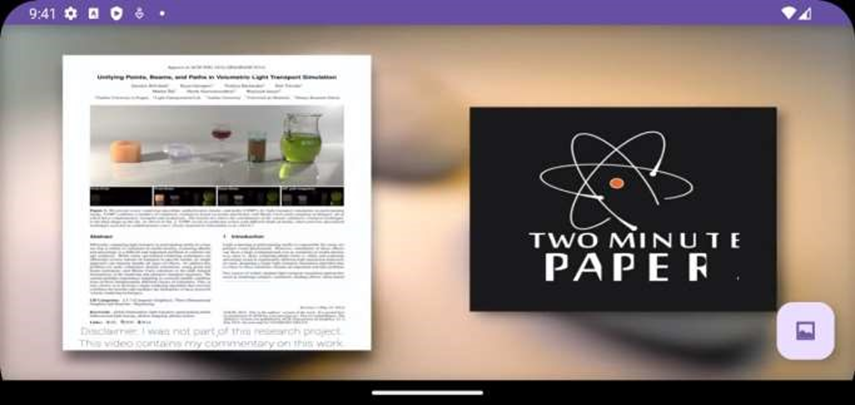
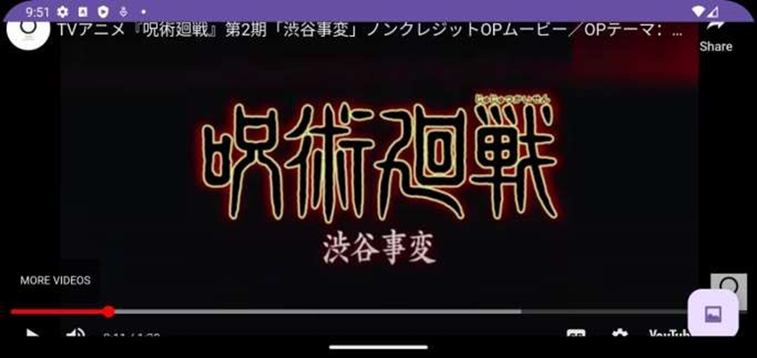

# MAD_P_7_21012011045

## AIM: 

Create Video player and Youtube player application by following below instructions.

1. Create MainActivity and YoutubeActivity with landscape orientation

2. MainActivity should have VideoView and YoutubeActivity should have WebView

3. There should be Floating Button on both Activities according to below image. After pressing that button, it will switch from one activity to another activity by using explicit intent.

4. Add Internet Permssion in Manifest file

## Screenshot

